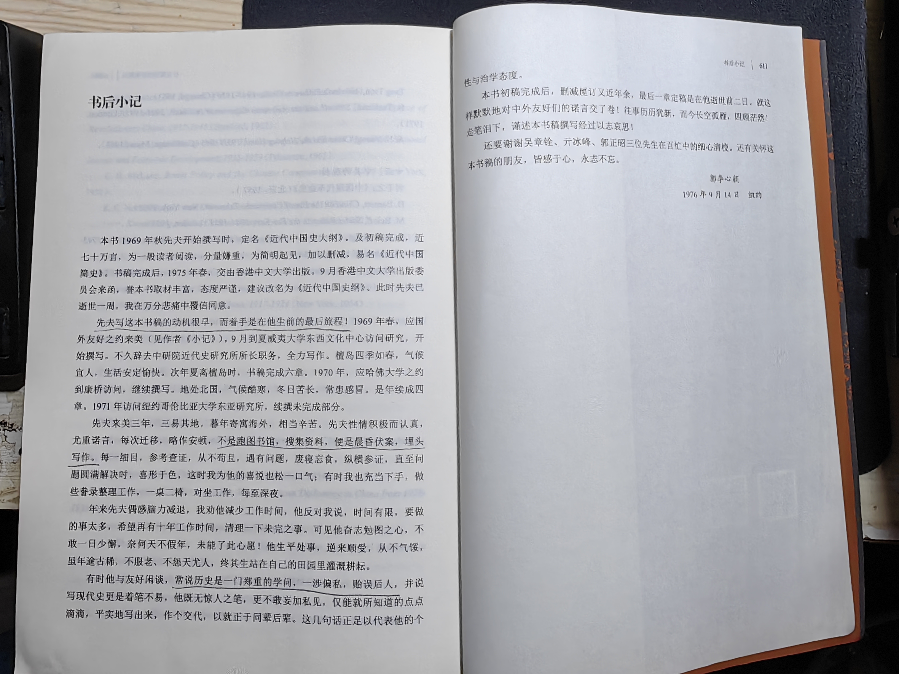

# 郭廷以《近代中国史纲》读书笔记

网上有的各种资料就不复制粘贴了，这本《近代中国史纲》，以史纲而言，堪称鸿篇巨著，涵盖了从清中后期，第一次鸦片战争始末为<b>起点</b>，到解放战争、共和国成立，抗美援朝发端为<b>终点</b>的一百多年的历史变迁。  

值得一提的是作者和读者的<b>政治立场</b>可能存在差异，对于“我国”和“我党”的设定自然与当今<b>中华人民共和国</b>的立场不尽一致。  
这个见仁见智，不可能求<b>天下大同</b>。  
并不影响这本书作为一部<b>经典历史著作</b>的评价。  

“当今”是流动的，正所谓不废江河万古流。  

## 目录

- [郭廷以《近代中国史纲》读书笔记](#郭廷以近代中国史纲读书笔记)
  - [目录](#目录)
  - [更新日志](#更新日志)
  - [写在开头](#写在开头)
  - [正文](#正文)
    - [第一章 世变前的中国与西方](#第一章-世变前的中国与西方)
    - [第二章 西力冲击（上），1830-1850](#第二章-西力冲击上1830-1850)
  - [写在结尾](#写在结尾)

<hr>

## 更新日志
|修改人|修改日期|修改内容|
|-|-|-|
|朱里|2024.11.25|整理笔记，第一章。|

<hr>

[](https://book.douban.com/subject/27119859/)


## 写在开头

这本中华书局再版的《近代中国史纲》，是2021年6月上在武汉时，作为闲书买的。  
三年以来，整个世界，以及个人的生活、事业都经历了剧变，最近才从箱子里翻了出来。  

曾经很喜欢写读书笔记，后来由于一些删删减减的事，兴趣大为索然。最近半个多月读完了，每天甚至没有了开机、打字的欲望。只想安安静静地看一本书。    

读到末页，由郭夫人写的<b>后记寄语</b>，不禁有感于郭先生<b>笔耕不辍</b>，直到晚年，依然勉力和专注于自己钟爱的事业。  


还是记下一笔，和自己的暮气尽力做一番斗争。  

这次一边读一边在书上画线，就像这样。  
还是动动笔更好。  


以下笔记的正文，也仅仅是对<b>划线部分</b>的一点思考罢了。  
毕竟重读一遍的话，这时间可就长了。  

最后，整本书读下来，应该还是有5-7个错别字，除非我买了本盗版书。  
以如此篇幅，有几个错字也是可以理解的。  

<hr>

## 正文

### 第一章 世变前的中国与西方

p1 ```三千余年的大变局```  
这话是近代史上常看到。往前推三千年，以1840年算就是公元前1200年了，那还是商纣王以前的奴隶制社会。  
这话的主旨当然还是针对以<b>封建帝制</b>和<b>儒家礼教</b>为代表的两千年。  

p3 ```中国在政治上陷于分裂，为期约300年```  
指3世纪，东晋以后，社会逐渐崩坏的年代。  
文化既迷失了方向，也得了一定自由。  
往后推300年，是隋唐时期了。  

p3 ```不掺杂政治的或经济的动机```  
佛教的一个显著优点。  

p4 ```中亚诸国脱离了唐的羁縻(音“迷”)...纪纲廉耻丧亡```  
五代十国介于唐宋之间，为中国历史上最破碎、最混乱、黑暗的时期之一，以至于如今很少被提及。  

p4 ```“存天理，灭人欲”...宋儒之所谓理，同于酷吏所谓法，为祸斯民至烈```  
可谓极端派儒家。  

p5 ```此一盛况，为期仅二十年...终明之世，通倭之禁甚严```  
历史上国泰民安，甚至只求温饱而不用朝不保夕的时间占比，其实不算多。  
内忧外患从未断绝，尽管闭关锁国者或有异议。  

p5 ```圣道已经大明，不烦后人发挥```  
这也是我很多年前第一次读《论语》《孟子》时的感受，为什么经学的祖师们都是巅峰，后人<b>不能也不允许</b>超越？  
而蒸汽机车发展到今天，已经是300公里时速的高铁了。  

p5 ```上焉者只知谈性论天...疲精死神于举业```  
清谈和制艺。  

p5 ```雍正初年，别立军机处...内阁遂成虚设```  
按F2重命名。  

p6 ```满洲兴起，全恃其特创的八旗武力...兵均世袭```
青年、壮年和暮年。  

p7 ```一面百般折磨，必令其俯首帖耳，志气丧尽。```  
这就是“呆气”？  

p7 ```一甲三名，即状元、榜眼、探花，分授翰林院修撰、编修。```  
二甲为进士出身，三甲为同进士出身。  

p8 ```博学鸿儒特科...统一学术思想```  
康乾时期的多元化尝试，不过根本还在于汇合人才、统一思想。  

p8 ```民族的朝气凿丧，朝野的志趣萎靡。```  
宏观的衰老。  

p8 ```乾隆一朝又被目为盛世的巅峰，其实是虚有其表。```  
实源于祖辈功业积累，得享其成。  

p9 ```清的高压政策，并不能使人完全驯服。```  
很多史家和人物（也包括伟大的毛主席）常用原动力、反动力来形容历史走向的偶然与必然。  
现在这个词变得非常忌讳，就改用<b>“反作用力”</b>吧。  
大概没有人再忌讳一个<b>物理概念</b>吧？  
这是科学的一大好处，从不浓妆艳抹，总是<b>朴素而真实</b>的。  

p10 ```地圆学说此时亦渐为部分人士所接受```  
大航海时代的成就。  

p11 ```利市高达六十倍```  
国际贸易的新世界。  

p14 ```“契丹大可汗（即中国皇帝）”```  
尚处互相陌生的世界各国，一如早年“佛郎机”这个多国混用的称呼。  

p14 ```然华商嗜利，趋死不顾，久之复成聚。...二万五千商民，尽膏锋刃，...西班牙人益无忌惮，既不畏惧中国，又需要中国的货物，华商亦仍然前往。```  
无利不起早，实话。  

p15 ```荷人先后与葡、英角逐，当地华侨备受池鱼之殃。```  
早期列强。  

p16 ```此为中英的初次直接接触，亦为冲突的序幕，双方均感不快。```  
虎门炮台。第一次武力冲突。  

p16 ```波雅科夫（Poyarkov）...哈巴洛夫（Khabarov）...哥萨克最为残暴。```  
俄乌各民族中相当凶悍的一支。  

p18 ```索额图、佟国纲```  
清朝满蒙大臣的名字有一些特点，多用一些<b>表意吉祥</b>的汉字做音译，比如文祥、善耆、官文、胜保、宝鋆、刚毅、荣禄、端方、瑞澂等。  
简称时以<b>名</b>的首字称呼，比如“荣中堂”，姓瓜尔佳名荣禄。  
很多人第一次看见<b>佟国维</b>，估计也想不出这是个满人，其实是佟佳氏的旗人。  

p18 ```张诚（Jean Francois Gerbillon）...徐日昇（Thomas Pereira）```  
外国人取中文名就更自由了，也是取吉祥字眼居多，有的略取音译，比如费正清（John King Fairbank）。  

p18 ```这是一次对等的谈判，是一个平等的条约。```  
我印象很深的是第一次了解这个条约是在地理课，而不是历史课。  
当时老师说《尼布楚条约》是中国近代史上，为数不多的<b>平等条约</b>。  

p20 ```沙勿略（St. Francis Xavier）...罗明坚（Michael Ruggiero）...利玛窦（Matteo Ricci，1552-1610）```  
音译名字。  

p20 ```1610年利玛窦卒，万里钦赐葬地。```  
颇受中国欢迎的利玛窦。  

p21 ```复有《万国图志》```  
自然百科全书，利玛窦与李之藻合编。  

p22 ```汤若望因历法旧派杨光先诬陷下狱...以钦天监杨光先推测不验，制器无方革职。```  
内行与外行。  

p23 ```这部地图即《皇舆全览图》，流行二百余年。```  
民国时期，有的作战用地图的测绘数据仍取自同治、光绪年间，可见专业勘测工作并未得到大力发展。  

p24 ```耶稣会士深知儒家权威之不可凌犯```  
所谓道统。其他诸子百家五花八门，断无此威严。  

p25 ```康熙所看中的是西洋科学技艺```  
康熙皇帝的英明在于勤奋务实和眼界开阔，唯独可惜的是，他没能从极致的集权思想中走出。  
在自己广泛了解新世界之后，对<b>民间</b>的科学技术探索进行了严格的<b>惩罚和封锁</b>。  

p25 ```游说陕甘总督年羹尧，并用拉丁字拼音通信。```  
对四爷来说，无异于灯下黑，自然忍不了。  
于是给教士们禁了。  

p26 ```私绘直隶、山东地图，交人带往广东，拟送罗马。```  
当属间谍行为，而且非常典型。  
作为普通人，也要注意外出游玩不要乱用手机、相机、望远镜。  

p26 ```康熙有使西人各献所长的雅量。...乾隆所爱的为西洋玩好之物，```  
毕竟高下之分，云泥之别。  

p27 ```徐光启的五世孙徐朝俊，承其家学，喜研数理，因恐涉“奇技淫巧之嫌”，不敢公开讲求。```  
如前文所说，敢于发明创造者，多罹灾祸。  
无人敢谈科学技术，此乃<b>道德君子</b>与<b>百工之人</b>的分野。  

p28 ```粤海关正额每年不过四万余两，盈余多至二十倍以上，干最后盈余亦列入正额。```  
一切糊涂账，最终都是交差和利己。  

p29 ```和珅的难以数计的珍藏，大都由此而来。```  
海关、进出口总是最肥的缺份之一。  

p30 ```一体加抽，且不止三分。```  
同上，多多益善。  

p30 ```俱为用心选购，以表示英国的文明。```  
早期中英外交，一件颇为<b>拙劣</b>的事，就是外人看重科技、商贸、文化交流，而清朝只重尊卑礼节。  
原本的善意，都成了尴尬。渐渐转为猜疑，再到恶意，直至冲突和战争。  

p31 ```深感中国人的知识浅陋，官吏贪污，人民困苦，武备废弛，一切虚有其表。```  
这段话对应的1784年，乾隆的“盛世”尚未结束。  
这当然不是马戛尔尼对中国的第一印象，但终归是出于愤怒和失望的评价，并非道听途说。  

p32 ```“中国为天下共主，岂能如此侮慢倨傲？”```  
嘉庆的话，如出一辙。  

p33 ```中国武备废弛已极，如要发展贸易，非口舌可以达成，势须诉诸武力。```  
于英国是知己知彼，且已在印度站稳，有步步为营的资本。  
于大清，则依然沉浸于昔日的天朝梦，对危机浑然不知。  

### 第二章 西力冲击（上），1830-1850

WIP

<hr>

## 写在结尾

其实创建文档时就写了，并非真的“写在结尾”。  

很多时候读一本书，很难有半点能留下的东西。  
那读书有没有用？我一向是抱定<b>基本没什么用</b>的观点的。  
正因为没用，才要去读。  
不是别人<b>要你去读</b>，而是<b>你要去读</b>。  

既然没什么用，读书<b>值不值</b>呢？  
可能有的瞬间，有的人，有的话，让你<b>怎么都忘不掉</b>，那就值了。  

比如蒋廷黻先生的《中国近代史》里，评价第一代洋务派代表，恭亲王奕䜣和大学士文祥时，说他们都是<b>绝不留恋旧时代</b>的人。  
过去的就是过去了，往前走才是生活的状态。  
